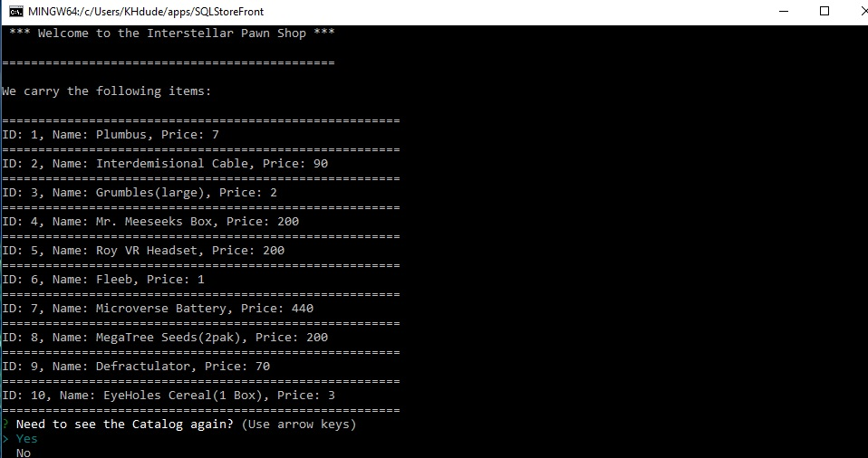
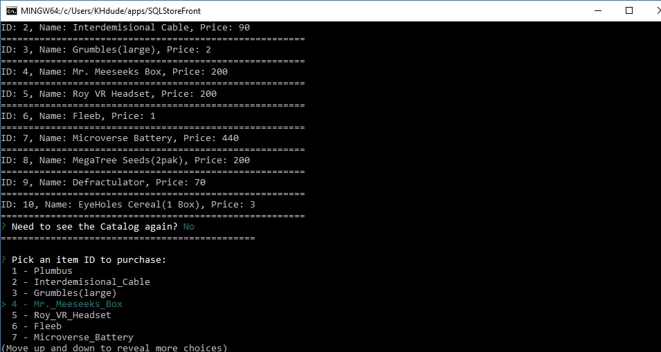
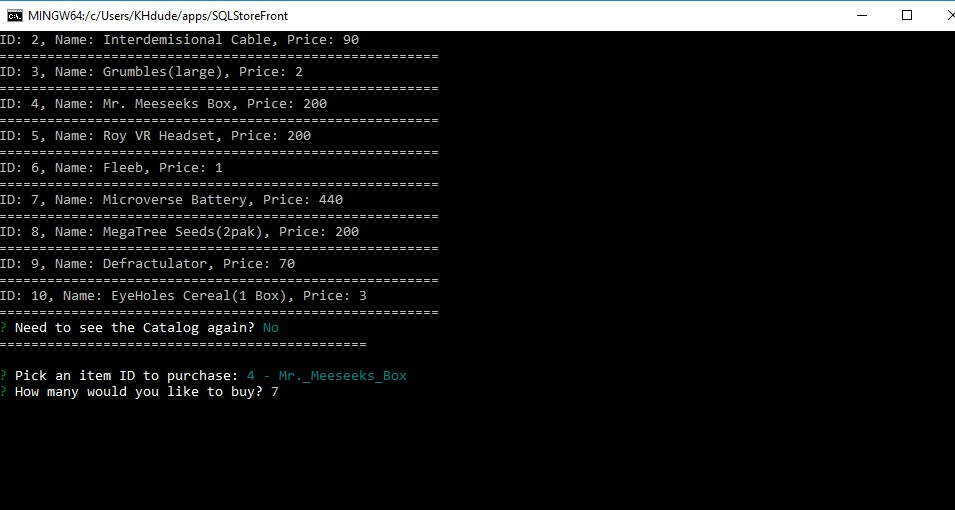

# Homework Node.js & MySQL

### Overview

This application allows any shopper (user) look at the products available in the StoreFront.

After listing the items, shoppers can select the item they with to buy. They will then be asked for a quantity.

If the desired quantity is available, the application will notify you of it's sale completion, give a total sales price for the total quantity, and update our StoreFront inventory.

2. **[Watch the demo video](hw_movie.mov)**
